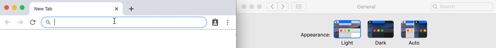

[](https://github.com/prettier/prettier)

# Angular Favicon

Use this Angular service to set the favicon of a site. 

You can also set an alternative favicon. This second favicon will be automatically shown when the browser/OS theme is set (or switches!) to dark mode.



## Usage

Install via npm:
```shell
npm install --save angular-favicon
```

Use it anywhere in your project:
```js
import { Component, OnInit } from '@angular/core';
import { AngularFaviconService } from 'angular-favicon';

@Component({
  selector: 'app-root',
  templateUrl: './app.component.html',
  styleUrls: ['./app.component.scss']
})
export class AppComponent implements OnInit {
  constructor(private ngxFavicon: AngularFaviconService) {}

  ngOnInit() {
    this.ngxFavicon.setFavicon(favicon_url);
    // OR 
    this.ngxFavicon.setFavicon(favicon_url, alt_favicon_url);
  }
}

```
